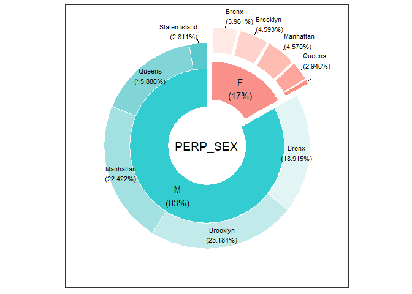
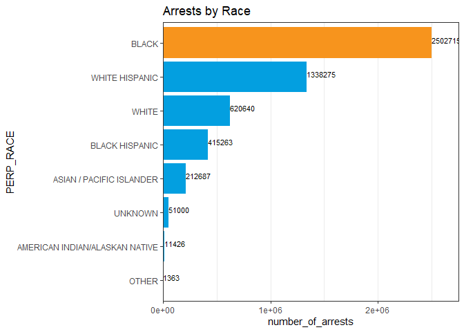
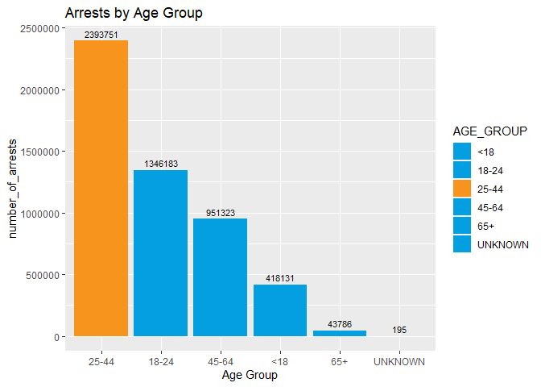

NYPD-arrests-EDA
================
Eneye
11/21/2021

### Introduction

### Data Source

#### Set Up Environment

Install and load packages that will be required.

#### Load Arrests data

``` r
glimpse(nypd_arrests)
```

    ## Rows: 5,153,369
    ## Columns: 19
    ## $ ARREST_KEY        <int> 32311380, 192799737, 193260691, 149117452, 190049060~
    ## $ ARREST_DATE       <chr> "06/18/2007", "01/26/2019", "02/06/2019", "01/06/201~
    ## $ PD_CD             <int> 511, 177, NA, 153, 157, 203, 153, 157, 175, 175, 101~
    ## $ PD_DESC           <chr> "CONTROLLED SUBSTANCE, POSSESSION 7", "SEXUAL ABUSE"~
    ## $ KY_CD             <int> 235, 116, NA, 104, 104, 352, 104, 104, 233, 233, 344~
    ## $ OFNS_DESC         <chr> "DANGEROUS DRUGS", "SEX CRIMES", "", "RAPE", "RAPE",~
    ## $ LAW_CODE          <chr> "PL 2200300", "PL 1306503", "PL 2203400", "PL 130250~
    ## $ LAW_CAT_CD        <chr> "M", "F", "F", "F", "F", "M", "F", "F", "M", "M", "M~
    ## $ ARREST_BORO       <chr> "Q", "M", "M", "K", "K", "K", "M", "K", "B", "M", "M~
    ## $ ARREST_PRECINCT   <int> 27, 25, 14, 67, 77, 77, 5, 77, 50, 26, 18, 1, 28, 11~
    ## $ JURISDICTION_CODE <int> 1, 0, 0, 0, 0, 2, 0, 0, 0, 0, 0, 0, 1, 0, 0, 0, 0, 0~
    ## $ AGE_GROUP         <chr> "18-24", "45-64", "25-44", "25-44", "25-44", "45-64"~
    ## $ PERP_SEX          <chr> "M", "M", "M", "M", "M", "M", "M", "M", "M", "F", "M~
    ## $ PERP_RACE         <chr> "BLACK", "BLACK", "UNKNOWN", "BLACK", "BLACK", "BLAC~
    ## $ X_COORD_CD        <dbl> NA, 1000555, 986685, 998032, 1003606, 1004580, 98494~
    ## $ Y_COORD_CD        <dbl> NA, 230994, 215375, 175598, 185050, 183838, 200203, ~
    ## $ Latitude          <dbl> NA, 40.80069, 40.75784, 40.64865, 40.67458, 40.67125~
    ## $ Longitude         <dbl> NA, -73.94111, -73.99121, -73.95034, -73.93022, -73.~
    ## $ Lon_Lat           <chr> "", "POINT (-73.94110928599997 40.800694331000045)",~

``` r
### Change date from chr to date format, and rename Boroughs to full names

nypd_arrests <- nypd_arrests %>% 
  mutate(ARREST_DATE = as.Date(ARREST_DATE, format = "%m/%d/%Y")) %>% 
  mutate(ARREST_BORO = recode(ARREST_BORO, "B" = "Bronx")) %>% 
  mutate(ARREST_BORO = recode(ARREST_BORO, "S" = "Staten Island")) %>%
  mutate(ARREST_BORO = recode(ARREST_BORO, "K" = "Brooklyn")) %>%
  mutate(ARREST_BORO = recode(ARREST_BORO, "M" = "Manhattan")) %>%
  mutate(ARREST_BORO = recode(ARREST_BORO, "Q" = "Queens"))

### Some borough fields were blank, I used lat long to find correct borough
  nypd_arrests[nypd_arrests$ARREST_KEY==86596544, "ARREST_BORO"] <- "Manhattan"
  nypd_arrests[nypd_arrests$ARREST_KEY==65627643, "ARREST_BORO"] <- "Manhattan"
  nypd_arrests[nypd_arrests$ARREST_KEY==61712847, "ARREST_BORO"] <- "Manhattan"
  nypd_arrests[nypd_arrests$ARREST_KEY==56349345, "ARREST_BORO"] <- "Brooklyn"
  nypd_arrests[nypd_arrests$ARREST_KEY==44798797, "ARREST_BORO"] <- "Brooklyn"
  nypd_arrests[nypd_arrests$ARREST_KEY==39275686, "ARREST_BORO"] <- "Bronx"
  nypd_arrests[nypd_arrests$ARREST_KEY==38776166, "ARREST_BORO"] <- "Manhattan"
  nypd_arrests[nypd_arrests$ARREST_KEY==37811154, "ARREST_BORO"] <- "Manhattan" 
```

``` r
###  Rename level of offences with full names

nypd_arrests <- nypd_arrests %>% 
  mutate(LAW_CAT_CD = recode(LAW_CAT_CD, "F" = "Felony")) %>% 
  mutate(LAW_CAT_CD = recode(LAW_CAT_CD, "M" = "Misdemeanor")) %>%
  mutate(LAW_CAT_CD = recode(LAW_CAT_CD, "V" = "Violation")) %>%
  mutate(LAW_CAT_CD = recode(LAW_CAT_CD, "I" = "Infraction"))

nypd_arrests[nypd_arrests$LAW_CAT_CD=="", "LAW_CAT_CD"] <- "Unspecified"
```

``` r
### Create new column with Jurisdiction code renamed

nypd_arrests <- nypd_arrests %>% 
  mutate(JURISDICTION = case_when(
    .$JURISDICTION_CODE == 0 ~ "Patrol",
    .$JURISDICTION_CODE == 1 ~ "Transit",
    .$JURISDICTION_CODE == 2 ~ "Housing",
    .$JURISDICTION_CODE >= 3 ~ "Others")
  )
```

``` r
### Rename age value


nypd_arrests$AGE_GROUP[which(!is.na(as.numeric(nypd_arrests$AGE_GROUP)))] <- "UNKNOWN"
```

    ## Warning in which(!is.na(as.numeric(nypd_arrests$AGE_GROUP))): NAs introduced by
    ## coercion

``` r
nypd_arrests[nypd_arrests$AGE_GROUP=="", "AGE_GROUP"] <- "UNKNOWN"
```

``` r
### Create new columns showing month and day of week for arrests

nypd_arrests$ARREST_MONTH <- format(as.Date(nypd_arrests$ARREST_DATE), "%B")
nypd_arrests$ARREST_YEAR <- format(as.Date(nypd_arrests$ARREST_DATE), "%Y")
nypd_arrests$ARREST_WEEKDAY <- format(as.Date(nypd_arrests$ARREST_DATE), "%A")
```

``` r
nypd_arrests %>% 
  group_by(ARREST_BORO, PERP_SEX) %>%  #groups by usertype and weekday
  summarise(number_of_arrests = n()) %>%  #calculates the number of rides and average
  arrange(ARREST_BORO, PERP_SEX)   # sorts
```

    ## `summarise()` has grouped output by 'ARREST_BORO'. You can override using the `.groups` argument.

    ## # A tibble: 10 x 3
    ## # Groups:   ARREST_BORO [5]
    ##    ARREST_BORO   PERP_SEX number_of_arrests
    ##    <chr>         <chr>                <int>
    ##  1 Bronx         F                   204125
    ##  2 Bronx         M                   974782
    ##  3 Brooklyn      F                   236710
    ##  4 Brooklyn      M                  1194752
    ##  5 Manhattan     F                   235493
    ##  6 Manhattan     M                  1155468
    ##  7 Queens        F                   151798
    ##  8 Queens        M                   818653
    ##  9 Staten Island F                    36746
    ## 10 Staten Island M                   144842

# Visualizations

``` r
### Arrests by Sex and Borough

arrests_by_sex <- nypd_arrests %>% 
  group_by(ARREST_BORO, PERP_SEX) %>%
  summarise(number_of_arrests = n())
```

    ## `summarise()` has grouped output by 'ARREST_BORO'. You can override using the `.groups` argument.

``` r
PieDonut(arrests_by_sex, aes(PERP_SEX, ARREST_BORO, count=number_of_arrests), ratioByGroup = FALSE, explode = 1, explodeDonut=TRUE, r0 = 0.45, r1 = 0.9)
```

    ## Warning: `guides(<scale> = FALSE)` is deprecated. Please use `guides(<scale> =
    ## "none")` instead.

    ## Warning: Ignoring unknown aesthetics: explode

    ## Warning: `guides(<scale> = FALSE)` is deprecated. Please use `guides(<scale> =
    ## "none")` instead.

<!-- -->

``` r
### Arrests by Race

arrests_by_race <- nypd_arrests %>% 
  group_by(PERP_RACE) %>%
  summarise(number_of_arrests = n())
ggplot(arrests_by_race,
       aes(x = number_of_arrests, y = reorder(PERP_RACE, -number_of_arrests), fill = PERP_RACE, label = number_of_arrests)) +
  geom_col() +
  geom_text(aes(label = number_of_arrests), vjust = 0, hjust = 0, size = 3) +
  scale_x_continuous(expand = expansion(mult = c(0, 0.1))) +
  scale_y_discrete(limits = rev) +
  scale_fill_manual(breaks = c("BLACK", "WHITE HISPANIC", "WHITE", "BLACK HISPANIC", "ASIAN / PACIFIC ISLANDER", "UNKNOWN", "AMERICAN INDIAN/ALASKAN NATIVE", "OTHER"),
                    values = c("#f7941d", "#039fe0", "#039fe0",
                               "#039fe0", "#039fe0", "#039fe0", "#039fe0","#039fe0")) +
  labs(x = "number_of_arrests",
       y = "PERP_RACE",
       title = "Arrests by Race") +
  theme_bw() +
  theme(panel.grid.major.y = element_blank(),
        legend.position = "off")
```

<!-- -->

``` r
### Arrests by Age

arrests_by_age <- nypd_arrests %>% 
  group_by(AGE_GROUP) %>%
  summarise(number_of_arrests = n())
ggplot(arrests_by_age, aes(x = number_of_arrests, y = reorder(AGE_GROUP, -number_of_arrests), fill = AGE_GROUP)) +
  geom_col(position = position_dodge()) +
  geom_text(aes(label = number_of_arrests), vjust = -0.5, hjust = 0.5, size = 3) +
  scale_fill_manual(breaks = c("<18", "18-24", "25-44", "45-64", "65+", "UNKNOWN"),
                    values = c("#039fe0", "#039fe0", "#f7941d",
                               "#039fe0", "#039fe0", "#039fe0")) +
  labs(x = "number_of_arrests",
       y = "Age Group",
       title = "Arrests by Age Group") +
  
  coord_flip()
```

<!-- -->
